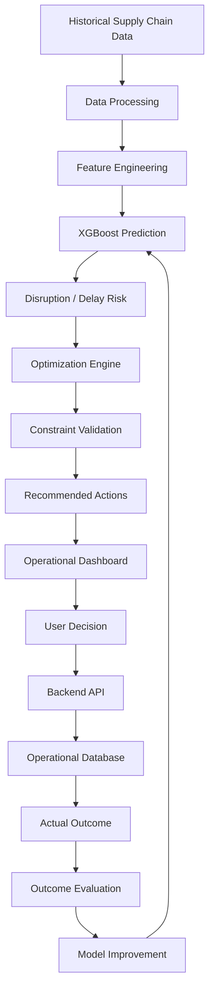

# Supply Prescript — Closed-Loop AI Supply Chain Decision Engine

> An AI-powered decision system combining supply-chain prediction, mathematical optimization, operational decision-making, and closed-loop outcome evaluation.

[](https://www.python.org/)
[](https://xgboost.readthedocs.io/)
[](https://fastapi.tiangolo.com/)
[](https://react.dev/)
[](https://git-scm.com/)

---

## Table of Contents

* [Overview](#overview)
* [Why Supply Prescript?](#why-supply-prescript)
* [Problem Statement](#problem-statement)
* [Core Capabilities](#core-capabilities)
* [System Architecture](#system-architecture)
* [Technology Stack](#technology-stack)
* [Machine Learning Pipeline](#machine-learning-pipeline)
* [Predictive Model](#predictive-model)
* [Prescriptive Optimization Engine](#prescriptive-optimization-engine)
* [Recommendation Workflow](#recommendation-workflow)
* [Operational Dashboard](#operational-dashboard)
* [Backend Architecture](#backend-architecture)
* [Database Architecture](#database-architecture)
* [Write-Back Architecture](#write-back-architecture)
* [Closed-Loop Analytics](#closed-loop-analytics)
* [Decision ROI](#decision-roi)
* [Continuous Learning](#continuous-learning)
* [End-to-End Example](#end-to-end-example)
* [Repository Structure](#repository-structure)
* [Installation](#installation)
* [Environment Configuration](#environment-configuration)
* [Running the Application](#running-the-application)
* [API Documentation](#api-documentation)
* [Testing](#testing)
* [Model Evaluation](#model-evaluation)
* [Optimization Validation](#optimization-validation)
* [Data & Governance](#data--governance)
* [Limitations](#limitations)
* [Future Improvements](#future-improvements)
* [Roadmap](#roadmap)
* [Skills Demonstrated](#skills-demonstrated)
* [Resume Description](#resume-description)
* [Technical Interview Topics](#technical-interview-topics)
* [Author](#author)
* [License](#license)

---

## Overview

**Supply Prescript** is a closed-loop AI supply-chain decision system designed to move operational analytics beyond prediction.

Traditional predictive analytics can answer:

> **What will happen?**

Supply Prescript extends this workflow toward:

> **What should we do?**

The system is designed around a two-stage decision process:

1. **Machine learning** identifies potential supply-chain disruptions and estimates disruption or delay risk.
2. **Mathematical optimization** evaluates possible operational responses while considering business constraints such as budget, delivery requirements, inventory, and capacity.

The resulting alternatives can be presented through an operational interface where a decision-maker can review the available options and select an action.

The selected decision can then be written back to an operational data store. Once the actual outcome becomes available, the system can compare the expected result with the observed result and use that feedback for future evaluation and model improvement.

### High-Level Workflow

```text
Historical Supply Chain Data
            ↓
Data Processing & Feature Engineering
            ↓
XGBoost Prediction Model
            ↓
Disruption / Delay Prediction
            ↓
Optimization Engine
            ↓
Constraint-Aware Alternatives
            ↓
Operational Dashboard
            ↓
User Decision
            ↓
Database Write-Back
            ↓
Actual Outcome
            ↓
Outcome Evaluation
            ↓
Model Improvement
```

The project is based on the **Supply Prescript — Closed-Loop Prescriptive Analytics** concept described in the project specification.

---

## Why Supply Prescript?

Supply-chain analytics can be viewed as three progressively more actionable levels:

```text
Descriptive Analytics
"What happened?"
        ↓
Predictive Analytics
"What will happen?"
        ↓
Prescriptive Analytics
"What should we do?"
```

Supply Prescript focuses on the transition from prediction to action.

A predictive model can identify that a shipment is likely to experience a delay. However, the prediction itself does not determine the operational response.

Possible responses may include:

* Expedited transportation
* Switching to another supplier
* Adjusting an expected delivery schedule
* Using available inventory
* Selecting another feasible operational alternative

Each action can have different costs, delivery implications, and resource requirements.

The optimization layer therefore acts as the bridge between:

```text
Prediction
     ↓
Business Constraints
     ↓
Optimization
     ↓
Actionable Alternatives
```

The broader closed-loop workflow is:

```text
Predict
   ↓
Recommend
   ↓
Execute
   ↓
Observe
   ↓
Evaluate
   ↓
Improve
```

This makes the system focused not only on identifying risk, but also on supporting operational decision-making.

---

## Problem Statement

Supply-chain operations frequently involve uncertainty around:

* Shipment delays
* Supplier disruptions
* Variable lead times
* Transportation costs
* Limited capacity
* Inventory availability
* Delivery deadlines
* Cost-versus-speed trade-offs

A dashboard that only reports predicted disruption risk still leaves an important operational question unanswered:

> **What action should be taken?**

Supply Prescript addresses this gap by combining predictive machine learning with constraint-aware optimization.

Instead of stopping at:

```text
"Shipment is likely to be delayed."
```

the system is designed to continue toward:

```text
"These are the feasible actions available under the current business constraints."
```

### Example Scenario

Consider a logistics manager who receives a warning about a potential **14-day microchip supply delay**.

Instead of simply displaying the prediction, the system can evaluate alternative responses such as:

* Expedited air freight
* Secondary supplier
* Delaying the launch
* Other feasible operational alternatives

The selected action can then become part of the operational record, allowing the eventual outcome to be evaluated.

---

## Core Capabilities

| Capability              | Description                                               | Status                |
| ----------------------- | --------------------------------------------------------- | --------------------- |
| Supply Chain Prediction | Predict potential shipment disruption or delay            | Planned / In Progress |
| XGBoost Model           | Machine-learning prediction engine                        | Planned / In Progress |
| Optimization Engine     | Generate feasible operational alternatives                | Planned / In Progress |
| Constraint Handling     | Apply budget, time, capacity, and operational constraints | Planned / In Progress |
| Recommendation Engine   | Present actionable alternatives                           | Planned / In Progress |
| Operational Dashboard   | Review predictions and recommendations                    | Planned / In Progress |
| Decision Write-Back     | Persist selected operational decisions                    | Planned / In Progress |
| Outcome Evaluation      | Compare predicted and actual outcomes                     | Planned               |
| Decision ROI            | Evaluate decision performance                             | Planned               |
| Continuous Learning     | Use feedback to improve future predictions                | Planned               |

> **Note:** Status values should be updated as each component is implemented. The repository should not claim a capability as implemented until the corresponding code exists and has been validated.

---

## System Architecture

The target architecture connects predictive analytics, optimization, decision execution, and feedback.



The exact architecture should evolve with the implementation.

---

## Technology Stack

| Layer                | Technology                             | Purpose                                |
| -------------------- | -------------------------------------- | -------------------------------------- |
| Programming Language | Python                                 | Core development                       |
| Data Processing      | Pandas / NumPy                         | Data preparation and analysis          |
| Machine Learning     | XGBoost                                | Supply-chain disruption prediction     |
| Optimization         | SciPy / PuLP                           | Constraint-based decision optimization |
| Backend              | FastAPI                                | API and application services           |
| Database             | PostgreSQL / other configured database | Operational persistence                |
| Frontend             | React                                  | Operational dashboard                  |
| Visualization        | Project-selected visualization library | Analytics and decision visualization   |
| Version Control      | Git / GitHub                           | Source control and collaboration       |

> Technologies should be retained in this table only after they are actually used in the repository.

---

# Machine Learning Pipeline

The predictive component is designed to process historical supply-chain information and generate disruption or delay predictions.

### Target Workflow

```text
Raw Data
   ↓
Data Cleaning
   ↓
Feature Engineering
   ↓
Train/Test Split
   ↓
XGBoost Training
   ↓
Model Evaluation
   ↓
Model Persistence
   ↓
Prediction
```

### Key Steps

#### 1. Data Preparation

Historical supply-chain records are prepared for machine-learning use.

Potential preprocessing activities include:

* Missing-value handling
* Data-type normalization
* Categorical feature processing
* Outlier investigation
* Feature validation

#### 2. Feature Engineering

Features are created from available historical supply-chain information.

Potential features may include:

* Historical lead time
* Supplier information
* Shipment characteristics
* Delivery information
* Cost-related variables
* Operational conditions

The final feature set must match the actual dataset and implementation.

#### 3. Model Training

The predictive model is trained using historical observations.

The proposed model for the project is **XGBoost**.

#### 4. Evaluation

The model should be evaluated using appropriate classification or regression metrics depending on the implemented target.

No performance metrics are reported here until they are generated from the actual implementation.

#### 5. Model Persistence

Once validated, the trained model can be persisted and loaded by the application for inference.

---

# Predictive Model

## Why XGBoost?

XGBoost is designed for efficient gradient-boosted decision-tree learning and is commonly used for structured/tabular datasets.

For this project, the model is intended to learn relationships between historical supply-chain characteristics and disruption-related outcomes.

The model's role is **predictive**, not prescriptive.

```text
Historical Supply Chain Features
             ↓
          XGBoost
             ↓
     Predicted Risk / Delay
```

The prediction becomes an input to the downstream optimization process.

### Model Responsibilities

The predictive layer is intended to:

* Process relevant historical features
* Estimate disruption or delay risk
* Provide predictions to the decision engine
* Support downstream optimization
* Provide measurable predictions that can later be compared with actual outcomes

Actual target variables, feature names, metrics, and model parameters should be documented from the implemented training pipeline.

---

# Prescriptive Optimization Engine

Prediction identifies a potential problem.

Optimization determines what can be done about it.

For example:

```text
Prediction:

Shipment has a high probability of being delayed.
```

The optimization layer asks:

```text
Given:

- Budget
- Delivery deadline
- Inventory
- Supplier capacity
- Transportation constraints
- Operational requirements

Which actions are feasible?
```

The optimization engine is therefore responsible for converting predicted risk into feasible operational alternatives.

## Optimization Components

### Objective

The objective defines what the optimization process is attempting to achieve.

Depending on the implemented formulation, this can involve balancing:

* Operational cost
* Delivery time
* Supply availability
* Business constraints

### Decision Variables

Decision variables represent the operational choices available to the system.

Examples may include:

* Transportation mode
* Supplier selection
* Shipment allocation
* Inventory utilization
* Schedule adjustment

The exact decision variables depend on the implemented optimization model.

### Constraints

The optimization problem can incorporate hard business constraints such as:

* Budget limits
* Delivery requirements
* Inventory availability
* Supplier capacity
* Transportation capacity

### Candidate Actions

The solver evaluates feasible combinations of decisions and produces alternatives that satisfy the defined constraints.

---

# Recommendation Workflow

The recommendation workflow connects machine-learning predictions with operational constraints.

```text
Prediction
     +
Business Constraints
     ↓
Optimization
     ↓
Candidate Actions
     ↓
Constraint Validation
     ↓
Recommended Alternatives
```

A recommendation can conceptually be represented as:

```text
Option A
Action:
Cost:
Expected Delivery:
Trade-off:

Option B
Action:
Cost:
Expected Delivery:
Trade-off:

Option C
Action:
Cost:
Expected Delivery:
Trade-off:
```

This format is illustrative. The actual recommendation structure should match the implemented application.

The goal is to allow a decision-maker to compare alternatives rather than receiving only a single model prediction.

---

# Operational Dashboard

The operational dashboard is intended to provide a decision-oriented interface for supply-chain events.

Depending on the implemented frontend, the dashboard can present information such as:

* Disruption alerts
* Predicted delay
* Risk level
* Recommended actions
* Cost comparison
* Delivery comparison
* Operational trade-offs
* Decision execution
* Decision history
* Outcome analytics

The dashboard should focus on helping users understand:

```text
What is happening?
        ↓
What is likely to happen?
        ↓
What can we do?
        ↓
What did we decide?
        ↓
What actually happened?
```

Only implemented dashboard features should be documented as available functionality.

---

# Backend Architecture

The backend provides the application services connecting machine learning, optimization, decision execution, and persistence.

A typical request flow is:

```text
Frontend
   ↓
FastAPI
   ↓
Prediction Service
   ↓
Optimization Service
   ↓
Recommendation
   ↓
Decision Execution
   ↓
Database
```

## Backend Responsibilities

The backend is intended to handle:

* API requests
* Input validation
* Prediction requests
* Optimization requests
* Recommendation generation
* Decision execution
* Database interaction
* Outcome evaluation

### API Endpoints

Actual endpoints should be documented here after implementation.

| Method | Endpoint | Description                                           |
| ------ | -------- | ----------------------------------------------------- |
| —      | —        | Endpoints will be documented from the implemented API |

> Endpoint names and request/response examples should never be inferred or invented.

---

# Database Architecture

The database layer is responsible for persisting operational information required by the application.

Potential entities include:

* Shipments
* Predictions
* Recommendations
* Decisions
* Outcomes

These entities should only be documented once they exist in the implemented database schema.

### Conceptual Data Flow

```text
Supply Chain Data
       ↓
Prediction
       ↓
Recommendation
       ↓
User Decision
       ↓
Operational Record
       ↓
Actual Outcome
```

The database therefore becomes an important part of the closed-loop workflow rather than simply acting as a passive reporting source.

---

# Write-Back Architecture

Traditional analytics systems often follow a read-only pattern:

```text
Database
    ↓
Dashboard
    ↓
User
```

Supply Prescript is designed around an operational write-back workflow:

```text
Database
    ↓
Prediction
    ↓
Optimization
    ↓
Recommendation
    ↓
User Decision
    ↓
Database
```

The write-back mechanism is important because it records what decision was actually made.

This creates a connection between:

```text
Prediction
    ↓
Decision
    ↓
Outcome
```

Without this information, a system can identify risks but has limited visibility into how its recommendations were acted upon.

---

# Closed-Loop Analytics

The central idea of Supply Prescript is the closed-loop workflow:

```text
Predict
   ↓
Recommend
   ↓
Execute
   ↓
Observe Actual Result
   ↓
Compare
   ↓
Learn
   ↓
Improve
```

## Prediction

The machine-learning model estimates a potential disruption or delay.

## Decision

The user reviews the available alternatives and selects an operational response.

## Actual Outcome

The actual result becomes available after the operational event occurs.

## Evaluation

The system can compare:

* Predicted result
* Expected decision impact
* Actual result

## Feedback

The difference between expectation and outcome provides information that can support future model evaluation and optimization improvements.

This creates a feedback loop rather than a one-way analytics pipeline.

---

# Decision ROI

Decision ROI is intended to evaluate the effectiveness of operational decisions.

Potential measurements include:

* Predicted cost
* Actual cost
* Cost difference
* Predicted delay
* Actual delay
* Avoided delay
* Decision effectiveness

Example conceptual structure:

```text
Predicted Cost
      ↓
Selected Action
      ↓
Actual Cost
      ↓
Cost Difference
```

The same principle can be applied to delivery performance:

```text
Predicted Delay
      ↓
Selected Action
      ↓
Actual Delay
      ↓
Delay Difference
```

Actual formulas and metrics should be documented once they are implemented and validated.

---

# Continuous Learning

The intended feedback mechanism is:

```text
Actual Outcome
      ↓
Prediction Error
      ↓
Feedback Data
      ↓
Model Evaluation
      ↓
Retraining
      ↓
Updated Model
```

Continuous learning should not be treated as an automatic capability unless the implementation actually supports automated retraining.

### Implemented

Document the feedback and retraining components here once they are implemented.

### Future Enhancement

Potential future functionality includes:

* Automated model retraining
* Model versioning
* Performance monitoring
* Drift detection
* Scheduled evaluation
* Model registry integration

---

# End-to-End Example

Consider a supply-chain disruption involving a critical component.

```text
1. A shipment enters the system.
2. Historical supply-chain features are processed.
3. The XGBoost model evaluates disruption risk.
4. A potential delay is predicted.
5. The optimization engine evaluates available responses.
6. Business constraints are applied.
7. Feasible alternatives are generated.
8. The alternatives are presented to the user.
9. The user selects an operational action.
10. The decision is persisted.
11. The actual shipment outcome becomes available.
12. Predicted and actual outcomes are compared.
13. Decision performance can be evaluated.
14. Feedback becomes available for future improvement.
```

The exact implemented workflow may contain fewer or additional steps depending on the current repository state.

---

# Repository Structure

The project is organized to separate data, machine learning, backend services, frontend components, database resources, testing, and documentation.

```text
SupplyPrescript/
│
├── backend/
│
├── frontend/
│
├── ml/
│
├── data/
│   ├── raw/
│   └── processed/
│
├── database/
│
├── notebooks/
│
├── models/
│
├── tests/
│
├── docs/
│
├── .gitignore
├── README.md
└── requirements.txt
```

The structure may evolve as additional application components are implemented.

---

# Installation

## 1. Clone the Repository

```bash
git clone <repository-url>
cd SupplyPrescript
```

Replace `<repository-url>` with the actual GitHub repository URL.

## 2. Create a Python Virtual Environment

### Windows

```bash
python -m venv venv
```

Activate the environment:

```bash
venv\Scripts\activate
```

## 3. Install Python Dependencies

```bash
pip install -r requirements.txt
```

## 4. Install Frontend Dependencies

If the React frontend is implemented:

```bash
cd frontend
npm install
```

---

# Environment Configuration

Environment-specific configuration should be stored outside source control.

Create a `.env` file locally when required by the application.

Example structure:

```env
DATABASE_URL=
API_URL=
MODEL_PATH=
```

Only variables actually required by the implementation should be included.

### Security

Never commit:

* API keys
* Database passwords
* Access tokens
* Cloud credentials
* Private certificates
* Other secrets

The `.env` file should be excluded through `.gitignore`.

---

# Running the Application

The exact commands depend on the implemented application structure.

## Backend

For a FastAPI application, the development server may be started using:

```bash
uvicorn main:app --reload
```

Run this command from the directory containing the application's `main.py`.

## Frontend

If the React application is implemented:

```bash
cd frontend
npm install
npm run dev
```

## Machine Learning

The training command should be documented once the ML training script has been implemented.

Example structure:

```bash
python <training-script>.py
```

## Database

Database initialization and migration commands should be documented once the database implementation is finalized.

---

# API Documentation

If FastAPI is implemented, the development API documentation is available through FastAPI's standard documentation interfaces.

Typical locations are:

```text
/docs
```

and:

```text
/redoc
```

The complete endpoint list should be documented here after the API implementation is finalized.

| Method | Endpoint | Purpose                                   |
| ------ | -------- | ----------------------------------------- |
| —      | —        | To be documented from the implemented API |

---

# Testing

Testing is an important part of validating an operational decision system.

Testing should cover the components that are actually implemented.

Potential testing areas include:

* Machine-learning functionality
* Prediction logic
* Optimization logic
* Constraint validation
* API behavior
* Database operations
* Integration workflows
* Decision write-back

## Constraint Validation

Particular attention should be given to ensuring that generated recommendations do not violate hard business constraints.

For example:

```text
Recommended Action
       ↓
Budget Check
       ↓
Capacity Check
       ↓
Delivery Check
       ↓
Inventory Check
       ↓
Feasible / Rejected
```

This prevents an operational recommendation from being considered valid simply because it has a favorable predicted outcome.

---

# Model Evaluation

Model evaluation should be based on results generated from the actual dataset and training pipeline.

Potential classification metrics include:

| Metric    |  Result |
| --------- | ------: |
| Accuracy  | Pending |
| Precision | Pending |
| Recall    | Pending |
| F1 Score  | Pending |

If the implemented target is regression-based, appropriate regression metrics should be used instead.

No model performance values are reported until they have been generated from the actual implementation.

---

# Optimization Validation

The optimization engine should validate recommendations against defined business constraints.

Important validation areas include:

### Budget

```text
Total Decision Cost <= Available Budget
```

### Delivery

The selected action should satisfy the required delivery constraints.

### Inventory

Recommendations should respect available inventory.

### Capacity

Supplier, transportation, or operational capacity should not be exceeded.

### Feasibility

An action should only be presented as feasible when it satisfies all applicable hard constraints.

The exact constraint formulation should match the implemented optimization model.

---

# Data & Governance

A decision-support system requires controlled handling of both analytical and operational data.

Important areas include:

### Data Validation

Input data should be validated before being passed into machine-learning or optimization workflows.

### Input Validation

API requests should validate required fields and expected data types.

### Credential Protection

Sensitive credentials should remain outside source control.

### Database Safety

Database writes should be controlled and validated.

### Controlled Write-Back

Operational decisions should only be persisted through defined application workflows.

### Model Versioning

Model artifacts should be traceable to their corresponding training process where model versioning is implemented.

### Reproducibility

Data preparation, model training, and optimization workflows should be reproducible as far as the implementation permits.

Only controls that are actually implemented should be marked as implemented.

---

# Limitations

The following limitations may apply depending on the final implementation:

* Use of synthetic or mock supply-chain data
* Limited historical observations
* Simulated operational outcomes
* Simplified optimization assumptions
* Limited supplier information
* Lack of real-time shipment integrations
* Limited representation of real-world supply-chain complexity

These limitations should be updated as the project evolves.

---

# Future Improvements

Potential future improvements include:

* Real supplier integrations
* Real-time shipment tracking
* Advanced demand and lead-time forecasting
* Multi-objective optimization
* Scenario simulation
* MLflow integration
* Model registry
* Model monitoring
* Automated retraining
* Role-based access control
* Cloud deployment
* Operational alerting
* Advanced decision analytics

These are future enhancements rather than current capabilities unless implemented.

---

# Roadmap

The roadmap will evolve alongside the implementation.

```text
[x] Repository setup
[x] Initial architecture

[ ] Dataset preparation
[ ] Exploratory data analysis
[ ] Feature engineering
[ ] XGBoost prediction model
[ ] Model evaluation
[ ] Optimization engine
[ ] Constraint validation
[ ] FastAPI backend
[ ] Database integration
[ ] React dashboard
[ ] Recommendation workflow
[ ] Decision write-back
[ ] Outcome evaluation
[ ] Decision ROI
[ ] Continuous learning
[ ] Testing
[ ] Documentation
```

Checklist items should be marked complete only after the corresponding functionality has been implemented and tested.

---

# Skills Demonstrated

## Machine Learning

* XGBoost
* Feature Engineering
* Predictive Analytics
* Model Evaluation
* Structured Data Modeling

## Optimization

* Mathematical Optimization
* Constraint-Based Decision Making
* Operations Research
* Feasibility Validation
* Cost-versus-speed trade-off analysis

## Backend

* Python
* FastAPI
* REST API Design
* Request Validation
* Service Architecture

## Data

* Pandas
* NumPy
* Data Processing
* Database Integration
* Operational Data Management

## Frontend

* React
* Dashboard Development
* Data Visualization
* Decision-Oriented UI

## Engineering

* Git
* GitHub
* API Design
* Database Design
* Testing
* ML Pipeline Design
* Closed-Loop Analytics
* Operational Write-Back Architecture

---

# Resume Description

## One-Line Version

> Built an AI-powered supply-chain decision engine combining XGBoost disruption prediction, constraint-based optimization, and operational decision workflows.

## Two-Line Version

> Developed Supply Prescript, a closed-loop supply-chain analytics system that combines machine-learning disruption prediction with mathematical optimization to generate constraint-aware operational alternatives.

> Designed the architecture to connect prediction, recommendation, decision write-back, outcome evaluation, and future model improvement.

## Interview Explanation

> **“Supply Prescript is an AI-powered supply-chain decision system that goes beyond predicting disruptions. I designed it around two main stages: first, a machine-learning model identifies potential disruption or delay risk from historical supply-chain data; then an optimization engine evaluates feasible actions under business constraints such as budget, delivery requirements, inventory, and capacity. The selected decision can be written back to the operational database, and the eventual outcome can be compared with the prediction so the system can support a closed feedback loop.”**

---

# Technical Interview Topics

## Why XGBoost?

XGBoost is a gradient-boosted tree algorithm that is well suited to structured and tabular data. Supply-chain datasets commonly contain heterogeneous operational variables, making tree-based models a practical choice for learning nonlinear relationships.

The actual model selection should ultimately be validated against the project's dataset and evaluation results.

---

## Why Is Prediction Alone Insufficient?

Prediction tells an organization what may happen, but it does not automatically determine the best operational response.

For example:

```text
Prediction:
Shipment may be delayed.
```

The operational question becomes:

```text
What should we do about the delay?
```

That second question requires business constraints, costs, resources, and available actions.

---

## Why Optimization?

Optimization provides a structured way to evaluate possible decisions while respecting business constraints.

Instead of simply selecting an action based on predicted risk, the system can evaluate:

```text
Possible Actions
       +
Business Constraints
       +
Operational Objectives
       ↓
Feasible Alternatives
```

---

## How Are Constraints Handled?

Constraints can represent real operational limits such as:

* Maximum budget
* Delivery deadlines
* Supplier capacity
* Transportation capacity
* Inventory availability

A recommendation should only be considered feasible when it satisfies the applicable hard constraints.

---

## How Are Recommendations Generated?

The general workflow is:

```text
Prediction
     ↓
Available Actions
     ↓
Business Constraints
     ↓
Optimization
     ↓
Feasible Alternatives
```

The exact implementation depends on the optimization formulation.

---

## How Does Write-Back Work?

Write-back means the system does not stop after displaying an analytical recommendation.

Instead:

```text
Recommendation
      ↓
User Decision
      ↓
Operational Database
```

The selected action becomes part of the operational record.

---

## How Is the Actual Outcome Evaluated?

After an operational event occurs, the actual result can be compared with the expected result.

For example:

```text
Predicted Cost → Actual Cost
Predicted Delay → Actual Delay
```

The differences can then be used for decision-performance analysis.

---

## What Makes the System Closed-Loop?

The system becomes closed-loop when information flows back from operational outcomes into the analytical process.

```text
Predict
   ↓
Recommend
   ↓
Execute
   ↓
Observe
   ↓
Evaluate
   ↓
Improve
```

This is different from a one-way dashboard that only reads data and displays predictions.

---

## How Could Continuous Learning Work?

A future continuous-learning workflow could be:

```text
Actual Outcomes
      ↓
Prediction Errors
      ↓
New Training Data
      ↓
Model Evaluation
      ↓
Retraining
      ↓
Updated Model
```

Production implementation would require additional safeguards such as model validation, versioning, monitoring, and controlled deployment.

---

## How Would This Architecture Scale?

Potential scaling strategies include:

* Separating prediction and optimization services
* Asynchronous processing for long-running optimization jobs
* Database indexing
* Caching frequently requested analytical results
* Containerized deployment
* Horizontal API scaling
* Model-serving infrastructure
* Monitoring and observability
* Model registry and version management

These are architectural considerations rather than claims about the current implementation.

---

## What Are the Current Limitations?

The primary limitations depend on the final implementation and dataset.

Potential limitations include:

* Synthetic data
* Simplified supply-chain assumptions
* Limited historical observations
* Simulated outcomes
* Limited real-time integrations
* Simplified optimization constraints

The repository should document the limitations that actually apply.

---

# Author

**Anshika Chauhan**

### Focus Areas

* Data Analytics
* Artificial Intelligence
* Machine Learning
* Python
* Business Intelligence

---

# License

No license is specified unless one has been explicitly selected for this repository.

If a license is added later, this section should be updated accordingly.

---

## Project Direction

Supply Prescript is designed around a simple progression:

```text
What happened?
      ↓
What will happen?
      ↓
What should we do?
      ↓
What did we decide?
      ↓
What actually happened?
      ↓
How can the next decision improve?
```

The goal is to build an end-to-end operational analytics system that connects **machine learning, optimization, APIs, databases, user decisions, and feedback** into one workflow.

---
